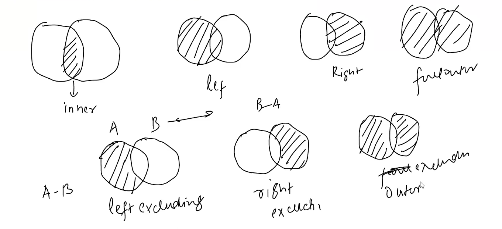

# SQL Interview Questions

## COUNT Functions

### Difference Between COUNT(*), COUNT(column_name), and COUNT(1)

- **COUNT(*)** counts all rows in a table, including those with NULL values in any column.
- **COUNT(column_name)** counts only the rows where the specified column is NOT NULL.
- **COUNT(1)** is a shorthand way of writing COUNT(*) and counts all rows in a table, including those with NULL values.

**CAN ALSO be written as COUNT(0) or COUNT('any constant value').**

## Dealing with NULL Values in SQL

### NULL Values with Non-NULL Values

If we have a null value and we perform any operation (e.g., addition, concatenation, comparison, etc.) with a non-null value, the result will be null always.

### ORDER BY with NULL Values

By default, in ascending order (ASC), NULL values appear first, and in descending order (DESC), NULL values appear last, so null values are considered as the lowest possible value. However, this behavior can vary depending on the database system.

### GROUP BY with NULL Values

When using GROUP BY, all NULL values are treated as a single group. So, if there are multiple rows with NULL in the grouped column, they will be grouped together.

### Aggregate Functions with NULL Values

When performing aggregate operations in MySQL, NULL values are treated differently depending on whether or not the GROUP BY clause is used.

#### Without GROUP BY

- If the aggregate function is **SUM**, **AVG**, **MAX**, **MIN**, or **COUNT**, NULL values are ignored and not included in the calculation.
- If the aggregate function is **GROUP_CONCAT** or **CONCAT**, NULL values are included in the result, but a NULL value is returned if all the values being concatenated are NULL.

#### With GROUP BY

- If the aggregate function is **COUNT**, NULL values are not included in the count for each group. However, if you use **COUNT(*)** instead of **COUNT(column)**, then NULL values are included in the count.
- If the aggregate function is **SUM**, **AVG**, **MAX**, **MIN**, NULL values are ignored and not included in the calculation for each group. If a group contains only NULL values, then the result for that group will be NULL.
- If the aggregate function is **GROUP_CONCAT** or **CONCAT**, NULL values are included in the result for each group, but a NULL value is returned if all the values being concatenated in a group are NULL.

### Finding NULL Values

To find null values in a specific column of a table, you can use the following SQL query:

```sql
SELECT * FROM table_name WHERE column_name IS NULL;
```

### Replacing NULL Values

To replace null values in a specific column of a table, you can use the `COALESCE` function or the `IFNULL` function (in MySQL) to provide a default value when a null is encountered. Here are examples of both methods:

Using `COALESCE`:

```sql
UPDATE table_name
SET column_name = COALESCE(column_name, 'default_value');
```

Using `IFNULL` (MySQL):

```sql
UPDATE table_name
SET column_name = IFNULL(column_name, 'default_value');
```

Or can just use it with select statement:

```sql
SELECT COALESCE(column_name, 'default_value') FROM table_name;
```

`Not that flexible as fillna in pandas since here we cant replace it with avg or median of that column directly`

## DELETE vs TRUNCATE vs DROP

### DELETE

This command is used to remove specific rows from a table based on a condition. It can be rolled back if used within a transaction. It is slower compared to TRUNCATE and DROP because it logs individual row deletions.

- If we use DELETE without a WHERE clause, it removes all rows from the table.
- It does not reset any auto-incrementing keys.
- It can be used with a WHERE clause to delete specific rows.
- It is a DML (Data Manipulation Language) command.

### TRUNCATE

This command is used to remove all rows from a table quickly and efficiently. It cannot be rolled back and does not log individual row deletions. It resets any auto-incrementing keys to their initial values.

- It cannot be used with a WHERE clause; it removes all rows.
- It is faster than DELETE for large tables.
- It is a DDL (Data Definition Language) command.

### DROP

This command is used to remove an entire table (or database) from the database. It cannot be rolled back and removes all data, structure, and associated objects (like indexes) from the database.

- It removes the entire table structure and all its data.
- It is irreversible; once a table is dropped, it cannot be recovered.
- It is a DDL (Data Definition Language) command.

## SQL Joins

### NON-EQUI JOINS

`Till now we have only seen equi joins where we use = operator to join two tables`

A non-equi join is a type of join that does not use the equality operator (=) to match rows between two tables. Instead, it uses other comparison operators such as <, >, <=, >=, or <> to establish the relationship between the tables.

#### Use Cases of Non-Equi Joins:

1. **Range-based joins**: When you want to join two tables based on a range of values, such as joining a table of employees with a table of salary ranges to find out which employees fall within each salary range.
2. **Inequality joins**: When you want to join two tables based on an inequality condition, such as joining a table of products with a table of discounts to find out which products are eligible for a discount based on their price.
3. **Date-based joins**: When you want to join two tables based on a date range, such as joining a table of orders with a table of promotions to find out which orders were placed during a specific promotion period.
4. **Spatial joins**: When you want to join two tables based on spatial relationships, such as joining a table of locations with a table of regions to find out which locations fall within each region.
5. **Custom business logic**: When you have specific business rules that require non-equality conditions to join tables, such as joining a table of customers with a table of loyalty programs based on their spending patterns.

### Natural Join

A natural join is a type of join that automatically matches columns between two tables based on their names and data types. It eliminates the need to specify the join condition explicitly. Natural joins can be either inner or outer joins.

#### Key Points:

- Columns with the same name in both tables are matched automatically.
- If there are no matching columns, a cross join is performed.
- Natural joins can simplify queries but may lead to unexpected results if there are unintended column matches.

#### Example:

```sql
SELECT * FROM table1 NATURAL JOIN table2;
```

This query will join `table1` and `table2` on all columns with the same name in both tables, returning only one instance of each matched column in the result set.

**If we don't have a common column name between the two tables, it will perform a cross join.**

But natural joins are not widely used in practice due to potential ambiguity and lack of control over the join conditions. Explicit joins (using ON or USING clauses) are generally preferred for clarity and maintainability.

### Anti Join (Exclusion Join)

An anti join is a type of join that returns rows from one table that do not have matching rows in another table. It is often used to find records in one table that are absent in another table. Anti joins can be implemented using various SQL constructs, such as LEFT JOIN with a WHERE clause, NOT EXISTS, or NOT IN.



Reference blog: [sql-joins](https://learnsql.com/blog/sql-joins/)

## ALL and ANY Operators

In SQL, ALL and ANY are comparison operators used in conjunction with subqueries to compare a value against a set of values returned by the subquery.

### ALL Operator

The ALL operator is used to compare a value to all values in a subquery. The condition is true only if the comparison holds true for every value returned by the subquery.

**Example:**

```sql
SELECT * FROM employees
WHERE salary > ALL (SELECT salary FROM employees WHERE department = 'Sales');
```

This query retrieves employees whose salary is greater than the salary of all employees in the Sales department.

### ANY Operator

The ANY operator is used to compare a value to any value in a subquery. The condition is true if the comparison holds true for at least one value returned by the subquery.

**Example:**

```sql
SELECT * FROM employees
WHERE salary > ANY (SELECT salary FROM employees WHERE department = 'Sales');
```

This query retrieves employees whose salary is greater than the salary of at least one employee in the Sales department.

## Working with Duplicates

### Finding Duplicates

Firstly lets find out duplicate values:

```sql
SELECT name , gender , age , COUNT(*) 
FROM duplicate_table
GROUP BY name , gender , age
HAVING COUNT(*) > 1 ;
```

### Removing Duplicates

To remove duplicates from a table in SQL, you can use the `DISTINCT` keyword in a `SELECT` statement or use a `DELETE` statement with a Common Table Expression (CTE) or a subquery. Here are two common methods:

duplicate_table contains duplcate data like [alex , m, 23 ] , [alex, m , 23] , [james , m ,34] ......

#### Method 1: Using DISTINCT

```sql
SELECT DISTINCT column1, column2, ...
FROM table_name;
```

This query retrieves unique rows based on the specified columns.

## Metadata Queries

this is done metadataqueries.sql
