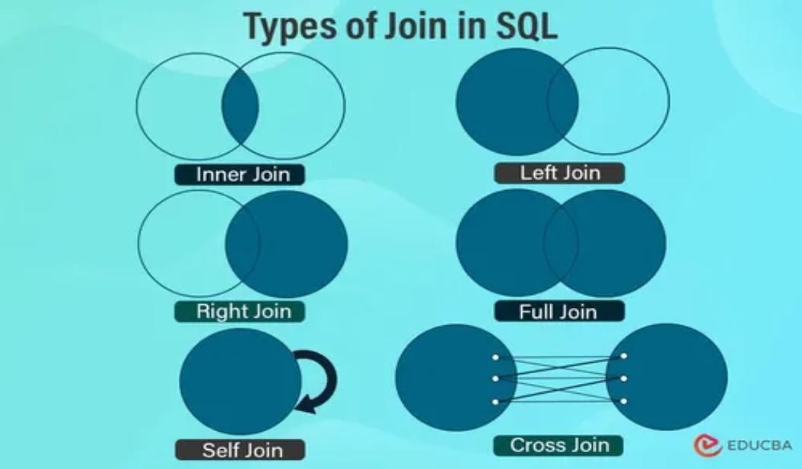
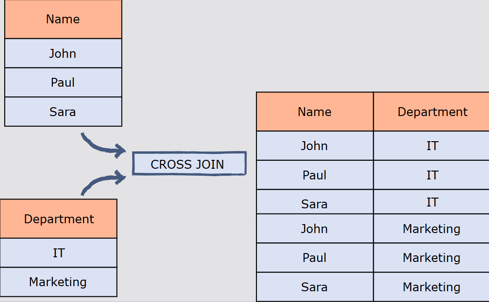
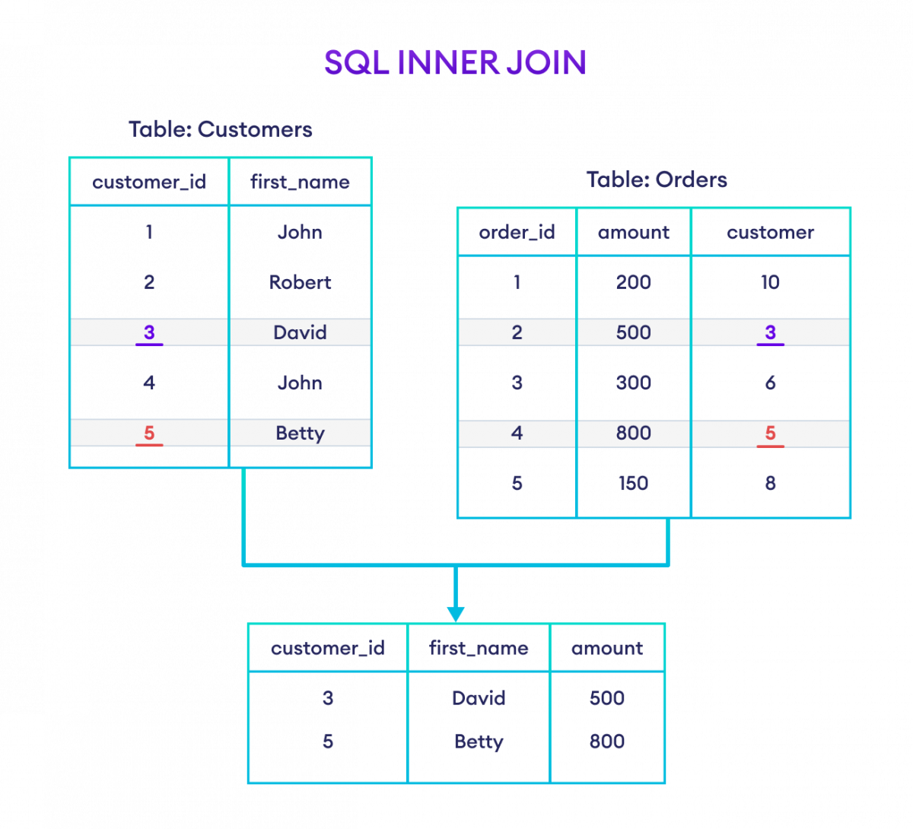
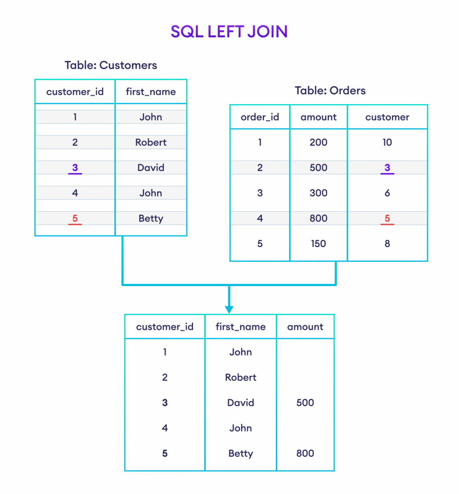
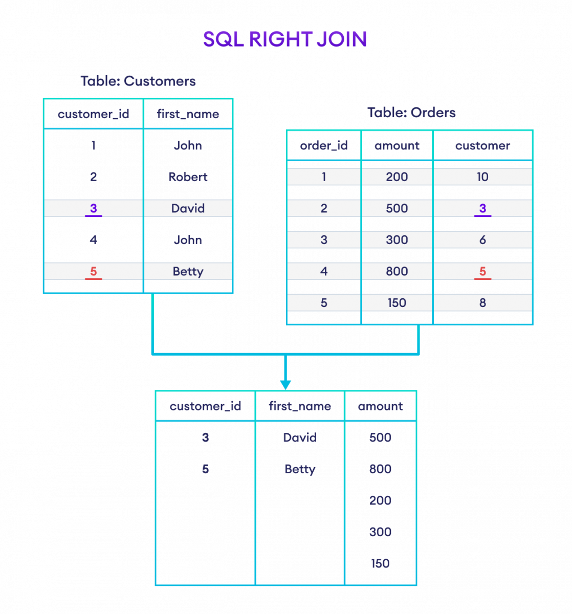
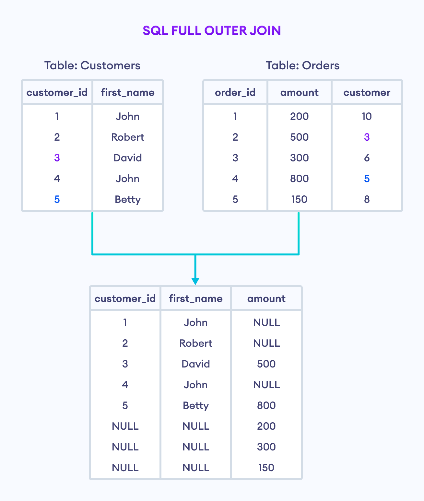

# Joins

Reference: [infytq - SQL Joins](https://infytq.onwingspan.com/web/en/viewer/web-module/lex_auth_0127673093222481924_shared?collectionId=lex_auth_012808459282808832527_shared&collectionType=Course&pathId=lex_auth_0127673123422863365_shared)

Reference: [w3schools - SQL Joins](https://www.w3schools.com/sql/sql_join.asp)

Reference: [Programiz - Joins in SQL](https://www.programiz.com/sql/join)

In SQL (Structured Query Language), a JOIN is a way to combine data from two or more database tables based on a related column between them .
Joins are used when we want to query information that is distributed across multiple tables in a database , and the information we need is not contained in a single table .
By joining tables together , we can create a virtual table that contains all of the information we need for our query .

To perform a JOIN , it is necessary to have a common column between the tables being joined . This common column is used to match rows from one table with rows from another table.

## Types of Joins



There are several types of JOINs in SQL , including:

1. `INNER JOIN :` Returns only the rows that have matching values in both tables .
2. `LEFT JOIN (or LEFT OUTER JOIN):` Returns all the rows from the left table , and the matched rows from the right table . If there is no match , NULL values are returned for columns from the right table .
3. `RIGHT JOIN (or RIGHT OUTER JOIN):` Returns all the rows from the right table , and the matched rows from the left table . If there is no match , NULL values are returned for columns from the left table .
4. `FULL JOIN (or FULL OUTER JOIN):` Returns all the rows when there is a match in either the left or right table . If there is no match , NULL values are returned for columns from the table without a match .
5. `CROSS JOIN:` Returns the Cartesian product of the two tables , meaning it returns all possible combinations of rows from both tables .
6. `SELF JOIN:` A self join is a regular join but the table is joined with itself .

### Cross Join

A CROSS JOIN returns the Cartesian product of the two tables , meaning it returns all possible combinations of rows from both tables .
Cross joins are not commonly used in practice , but they can be useful in certain situations , such as when generating test data or when performing combinatorial analysis . it's important to use cross joins with caution , as they can result in very large result sets that can be difficult to work with , can also impact performance and resource usage .

- Syntax :

    ```sql
    SELECT column1, column2, ...
    FROM table1
    CROSS JOIN table2;
    ```

**Example:**

```sql
    SELECT * 
    FROM Customers
    CROSS JOIN Orders;
```



### Inner Join

An INNER JOIN returns only the rows that have matching values in both tables. It is the most common type of join used in SQL.
In SQL, an inner join is a type of join operation that combines data from two or more tables based on a specified condition. The inner join returns only the rows from both tables that satisfy the specified condition, i.e., the matching rows.

When you perform an inner join on two tables, the result set will only contain rows where there is a match between the joining columns in both tables. If there is no match, then the row will not be included in the result set.

- Syntax :

    ```sql
    SELECT columns_from_both_tables
    FROM table1
    INNER JOIN table2
    ON table1.column1 = table2.column2  -- common column for joining
    WHERE additional_conditions;  -- optional filtering conditions
    ```

**Example:**

```sql
-- join Customers and Orders tables with their matching fields customer_id

    SELECT Customers.customer_id, Orders.item
    FROM Customers
    INNER JOIN Orders
    ON Customers.customer_id = Orders.customer_id;
```



### Left Join

A left join, also known as a left outer join, is a type of SQL join operation that returns all the rows from the left table (also known as the "first" table) and matching rows from the right table (also known as the "second" table). If there are no matching rows in the right table, the result will contain NULL values in the columns that come from the right table.

In other words, a left join combines the rows from both tables based on a common column, but it also includes all the rows from the left table, even if there are no matches in the right table. This is useful when you want to include all the records from the first table, but only some records from the second table.

- Syntax :

    ```sql
    SELECT columns_from_both_tables
    FROM table1
    LEFT JOIN table2
    ON table1.column1 = table2.column2  -- common column for joining
    WHERE additional_conditions;  -- optional filtering conditions
    ```

**Example:**

```sql
    -- left join the Customers and Orders tables

    SELECT Customers.customer_id, Customers.first_name, Orders.amount
    FROM Customers
    LEFT JOIN Orders
    ON Customers.customer_id = Orders.customer_id;
```



### Right Join

A right join, also known as a right outer join, is a type of join operation in SQL that returns all the rows from the right table and matching rows from the left table. If there are no matches in the left table, the result will still contain all the rows from the right table, with NULL values for the columns from the left table.

- Syntax :

    ```sql
    SELECT columns_from_both_tables
    FROM table1
    RIGHT JOIN table2
    ON table1.column1 = table2.column2
    WHERE additional_conditions;  -- optional filtering conditions
    ```

**Example:**

```sql
    -- right join the Customers and Orders tables

-- join Customers and Orders tables
-- based on customer_id of Customers and customer of Orders
-- Customers is the left table
-- Orders is the right table

    SELECT Customers.customer_id, Customers.first_name, Orders.amount
    FROM Customers
    RIGHT JOIN Orders
    ON Customers.customer_id = Orders.customer;
```



- SQL RIGHT JOIN With WHERE Clause

```sql
    SELECT Customers.customer_id, Customers.first_name, Orders.amount
    FROM Customers
    RIGHT JOIN Orders
    ON Customers.customer_id = Orders.customer
    WHERE Orders.amount >= 500;
```

- SQL RIGHT JOIN With AS Alias

```sql
    -- use alias C for Categories table
    -- use alias P for Products table
    SELECT C.category_name, P.product_title
    FROM Categories AS C
    RIGHT JOIN Products AS P
    ON C.cat_id = P.cat_id;
```

### Full Join

A full outer join, sometimes called a full join, is a type of join operation in SQL that returns all matching rows from both the left and right tables, as well as any non-matching rows from either table. In other words, a full outer join returns all the rows from both tables and matches rows with common values in the specified columns, and fills in NULL values for columns where there is no match.

`Full join can't be performed directly in MySQL as it doesn't support FULL OUTER JOIN syntax, so we can achieve the same result using a combination of LEFT JOIN and RIGHT JOIN with UNION.`

- Syntax :

```sql
    SELECT columns
    FROM table1
    FULL OUTER JOIN table2
    ON table1.column1 = table2.column2;
    WHERE additional_conditions;  -- optional filtering conditions
```

**Example:**

```sql
    SELECT Customers.customer_id, Customers.first_name, Orders.amount
    FROM Customers
    FULL OUTER JOIN Orders
    ON Customers.customer_id = Orders.customer;
```



- SQL FULL OUTER JOIN With WHERE Clause

```sql
    SELECT Customers.customer_id, Customers.first_name, Orders.amount
    FROM Customers
    FULL OUTER JOIN Orders
    ON Customers.customer_id = Orders.customer
    WHERE Orders.amount >= 500;
```

- SQL FULL OUTER JOIN With AS Alias

```sql
    -- use alias C for Categories table
    -- use alias P for Products table
    SELECT C.category_name, P.product_title
    FROM Categories AS C
    FULL OUTER JOIN Products AS P
    ON C.category_id = P.cat_id;
```

### Self Join

A self join is a type of join in which a table is joined with itself. This means that the table is treated as two separate tables, with each row in the table being compared to every other row in the same table.

Self joins are used when you want to compare the values of two different rows within the same table. For example, you might use a self join to compare the salaries of two employees who work in the same department, or to find all pairs of customers who have the same billing address.

- Syntax :

    ```sql
    SELECT a.column1, b.column2, ...
    FROM table_name a       -- a is an alias for the first instance of the table
    JOIN table_name b       -- b is an alias for the second instance of the table
    ON a.common_column = b.common_column    -- common column for joining but since table is same we use alias to differentiate
    WHERE additional_conditions;  -- optional filtering conditions
    ```

**Example:**

```sql
    -- retrieve Customers with the Same Country and Different Customer IDs

    SELECT
        c1.first_name,
        c1.country,
        c2.first_name 
    FROM Customers c1
    JOIN Customers c2 ON c1.country = c2.country
    WHERE c1.customer_id <> c2.customer_id;
```

```sql
-- retrieve Customers with the same Country and Different Customer IDs
-- use AS alias for better code readability
    SELECT
        c1.first_name,
        c1.country,
        c2.first_name AS friend_name
    FROM Customers c1
    JOIN Customers c2 ON c1.country = c2.country
    WHERE c1.customer_id <> c2.customer_id;
```

# Set Operations

1. **UNION**: The UNION operator is used to combine the results of two or more SELECT statements into a single result set. The UNION operator removes duplicate rows between the various SELECT statements.
2. **UNION ALL**: The UNION ALL operator is similar to the UNION operator, but it does not remove duplicate rows from the result set.
3. **INTERSECT**: The INTERSECT operator returns only the rows that appear in both result sets of two SELECT statements.
4. **EXCEPT**: The EXCEPT or MINUS operator returns only the distinct rows that appear in the first result set but not in the second result set of two SELECT statements.
