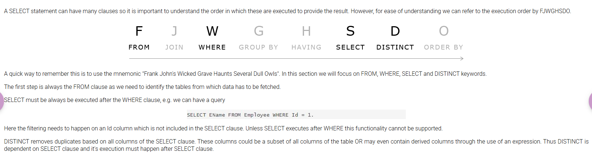

# Order of Execution

Reference: InfyTQ — Order of Execution course module  
[Open the module on InfyTQ](https://infytq.onwingspan.com/web/en/viewer/web-module/lex_auth_01270711371270553642_shared?collectionId=lex_auth_01275806667282022456_shared&collectionType=Course&pathId=lex_auth_0130086059766251521298_shared)

