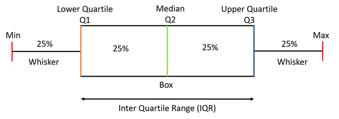

# What are Window Functions?

**Simplified Definition:**  
Window functions in SQL allow you to perform calculations (like sums, averages, rankings) on a group of rows that are related to the current row, without collapsing them into a single result.

**Enhanced Explanation:**  
Window functions are a special type of SQL function used for analytical calculations across a set of rows related to the current row—this set is called a "window." Instead of returning just one result for the whole group (like GROUP BY), window functions return a value for each row, considering other rows in the defined window.

The window is defined using the `OVER()` clause, which lets you:

- **Partition:** Split rows into groups based on a column or expression.
- **Order:** Set the order in which rows are processed within each group.

This makes it possible to, for example, calculate running totals, ranks, or moving averages directly in your query.

---

**Summary:**  
Window functions are powerful tools in SQL for performing calculations based on related rows, using flexible partitioning and ordering with the `OVER()` clause.

## Aggregate Functions with over()

when we use aggregate functions with over() clause it becomes window function

```sql
SELECT AVG(cgpa) OVER (PARTITION BY branch) as avg_cgpa_branch
FROM temp.students;
```

This query calculates the average CGPA for each branch without collapsing the rows, thanks to the window function. so each student row will have the average CGPA of their respective branch.

## Frames in Window Functions

**Simplified Definition:**  
A frame in a window function defines which rows are considered for calculations (like running totals or ranking) for each row in your result set. The frame is set using the `ROWS` and `BETWEEN` clauses.

**Enhanced Explanation:**  
A frame is a subset of rows within a partition that determines the scope for window function calculations. You use the `ROWS` clause to specify how many rows before or after the current row should be included. The `BETWEEN` clause sets the boundaries of this frame.

For example, `ROWS 3 PRECEDING` means the frame contains the current row and the three rows before it within that partition.

---

### Examples of Frame Clauses

- **ROWS BETWEEN UNBOUNDED PRECEDING AND CURRENT ROW**  
  Includes all rows from the start of the partition up to and including the current row, it is the default frame for many window functions.
- **ROWS BETWEEN 1 PRECEDING AND 1 FOLLOWING**  
  Includes the current row, one row before, and one row after .
- **ROWS BETWEEN UNBOUNDED PRECEDING AND UNBOUNDED FOLLOWING**  
  Includes all rows in the partition , regardless of the current row's position.
- **ROWS BETWEEN 3 PRECEDING AND 2 FOLLOWING**  
  Includes the current row, three rows before, and two rows after.

---

### Visual Example of Partitions and Frames

Suppose you have a student table with columns: name, branch, and marks. The data is partitioned by branch (EEE and CSE). Each branch forms its own group. When applying a window function, each frame is calculated within its partition.

---

### Code Examples: Using Frames in Window Functions

To find the student with the maximum CGPA:

```sql
SELECT *, FIRST_VALUE(name) OVER(ORDER BY cgpa DESC) AS max_cgpa_student
FROM temp.students;
```

To find the student with the minimum CGPA:

```sql
SELECT *, LAST_VALUE(name) OVER(ORDER BY cgpa ASC) AS min_cgpa_student
FROM temp.students;
-- Note: By default, the frame is RANGE BETWEEN UNBOUNDED PRECEDING AND CURRENT ROW,
-- to make it work as expected we need to change the window frame to UNBOUNDED FOLLOWING 
SELECT * , LAST_VALUE(name) OVER(ORDER BY cgpa ASC ROWS BETWEEN UNBOUNDED PRECEDING AND UNBOUNDED FOLLOWING) as min_cgpa_student FROM temp.students ;
```

---


**Summary:**  
Frames let you control which rows are used in window function calculations, making SQL analytics flexible for tasks like finding running totals, ranks, or min/max values within specific groups.

---

## Running Average

Running average (also known as *moving average*) is a statistical technique that calculates the average value of a dataset over a moving window of consecutive data points.

The window size determines the number of data points used to calculate the average, and as the window moves forward in time, the average is recalculated using the new data points and dropping the oldest one. This means that the running average is continuously updated and reflects the most recent trends in the data.

For example, a running average of a batsman's runs scored over a window of 10 matches will calculate the average runs scored in the last 10 matches, then move the window one match forward and recalculate the average for the new set of 10 matches, and so on.

Running averages are often used in finance, economics, and engineering to smooth out noisy or volatile data series, and to identify trends or patterns that may be obscured by random fluctuations in the data.

---

## Percent of total

Percent of total refers to the percentage or proportion of a specific value in relation to the total value. It is a commonly used metric to represent the relative importance or contribution of a particular value within a larger group or population.

| category    | total_sales | percent_of_total |
|-------------|-------------|------------------|
| Category A  | 500         | 50%              |
| Category B  | 300         | 30%              |
| Category C  | 200         | 20%              |

---

## Percentiles & Quantiles

A **Quantile** is a measure of the distribution of a dataset that divides the data into any number of equally sized intervals. For example, a dataset could be divided into **deciles** (ten equal parts), **quartiles** (four equal parts), **percentiles** (100 equal parts), or any other number of intervals.

Each quantile represents a value below which a certain percentage of the data falls. For example, the 25th percentile (also known as the first quartile, or Q1) represents the value below which 25% of the data falls. The 50th percentile (also known as the median) represents the value below which 50% of the data falls, and so on.



---

## Segmentation

Segmentation using NTILE is a technique in SQL for dividing a dataset into equal-sized groups based on some criteria or conditions, and then performing calculations or analysis on each group separately using window functions.
